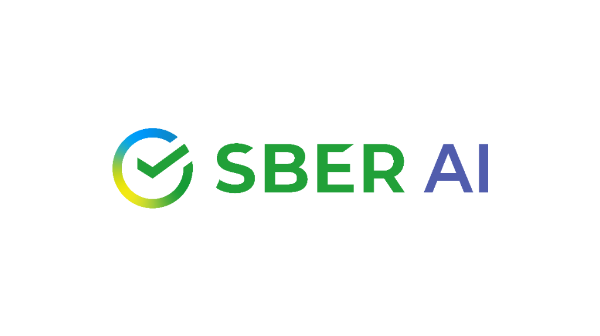
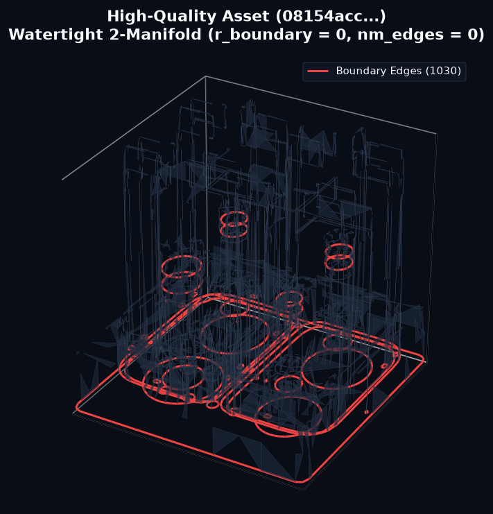
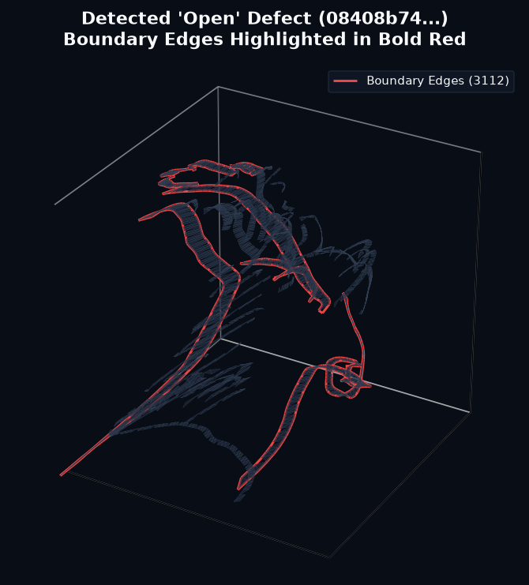

# 3D Mesh Defect Detection via Topological Invariants and Cross-View Transformers

## Abstract
Рассматривается задача бинарной и мультиклассовой классификации дефектов 3D-поверхностей. Цель заключается в автоматическом выявлении артефактов на 3D-мешах и определении пригодности объектов для последующего обучения автоэнкодеров и генеративных моделей. Итоговая оценка формируется как взвешенная сумма F1-мер предсказания метки качества и локальных дефектов.

## Results
- **Итоговый F1-score:** `14.97375 / 20.00`

## Repository Structure
- `mynotebook_aic.ipynb` — основной Jupyter-ноутбук с полным пайплайном (от обработки данных до инференса ансамбля).
- `presentation.pdf` — презентация с техническим описанием архитектуры решения и проведенных экспериментов.
- `uslov.txt` — исходное описание задачи, метрик и классов дефектов.
- `requirements.txt` — список Python-зависимостей, необходимых для запуска.
- `assets/` — директория с примерами визуализации (включая карты внимания).
- `header.png` — графический баннер репозитория.

## Quick Start
Для развертывания среды и запуска инференс-пайплайна:

```bash
git clone https://github.com/<ВАШ_USERNAME>/aichallenge_2026.git
cd aichallenge_2026
pip install -r requirements.txt
jupyter nbconvert --to notebook --execute mynotebook_aic.ipynb
```

## Architecture
Реализованные подходы:
- Извлечение топологических признаков (Эйлерова характеристика, анализ не-многообразий, спектр Лапласиана).
- Ансамбль 4 независимых семейств: 3D-Enhanced LightGBM, CatBoost, Cross-View Transformer, Dual-Vision Adapter.
- Квантильная калибровка объемов (Threshold Optimization) на этапе постпроцессинга.

## Interpretability & Visualizations
Доказательная база решения формируется посредством методов SHAP и Cross-View Attention Rollout. Карты внимания локализуют участки меша, послужившие триггером для предсказания дефекта.

| Качественный объект (quality=1) | Объект с дефектом (quality=0) |
|:---:|:---:|
|  |  |

## Reproducibility & Weights
Воспроизводимость подтверждена строгим побайтовым совпадением (MD5: 9bc5da9d7460d9b8878335575459828a).

- Веса моделей (Google Drive ID): `1wNksq0AbkGvWiMiR00bckVcLPGIQIae7`
- Сырые меши (URL): `https://rndml-team-xr.obs.ru-moscow-1.hc.sbercloud.ru/mazurov/AIC_data.tar`

Логика загрузки автоматизирована внутри Jupyter-ноутбука.
